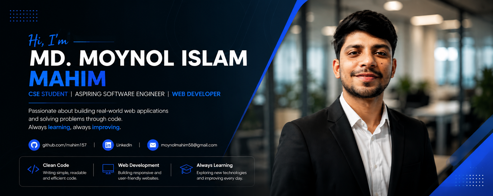

<!-- ===================== PROFILE BANNER ===================== -->

  

<!-- ===================== INTRO ===================== -->

<h1 align="center">Hi 👋, I'm Md. Moynol Islam Mahim</h1>

<h3 align="center">
  🎓 CSE Student | 💻 Aspiring Software Engineer | 🌱 Web Development Learner
</h3>

## 👨‍💻 About Me

I'm a Computer Science & Engineering student who is currently
building my foundation in programming and web development.

I enjoy learning new technologies, solving programming problems,
and building small projects to turn what I learn into practical work.

- 🎓 Computer Science & Engineering Student
- 🌱 Currently learning **JavaScript, TypeScript & Modern Web Development**
- 💻 Interested in **Web Development & Software Engineering**
- 📚 Learning through academic projects and practical projects
- 🧩 Practicing programming and problem solving
- 🚀 Improving my skills step by step
- 🇧🇩 Bangladesh

---

## 🌐 Socials:

# 🛠️ Skills & Technologies

### 💻 Programming Languages

  

### 🌐 Web Development

  

### 🗄️ Database & Tools

  

---

# 🚀 Projects

## 🌐 Web Portfolio

A personal portfolio website created while learning
HTML and CSS.

🔗 **Repository:**  
[Web Portfolio](https://github.com/mahim157/web-portfoli)

---

## ☕ Coffee Shop Website

A simple coffee shop website created to practice
HTML, CSS and basic web page design.

🔗 **Repository:**  
[Coffee Shop Website](https://github.com/mahim157/Coffee-Shop-website)

---

## 📄 Assignment 1

A web development assignment created as part of my
learning journey.

🔗 **Repository:**  
[Assignment 1](https://github.com/mahim157/Assignment-1)

---

# 🎓 Academic Projects

## 📊 Data Science Projects

As part of my academic learning in Data Science, I worked on
projects involving data collection, cleaning and exploratory
data analysis.

### Projects

- 📚 **Study Hours vs CGPA**
- 📱 **Social Media Usage vs Concentration Level**

These projects helped me practice working with real-world data
and understanding relationships between variables.

---

## 🎮 Interactive Animated Village Landscape

A Computer Graphics academic project developed using:

- C++
- OpenGL
- GLUT / FreeGLUT

The project focuses on creating an interactive and animated
village environment using computer graphics techniques.

---

# 📚 Currently Learning

  

Currently focusing on:

- JavaScript fundamentals
- TypeScript
- Modern Web Development
- Backend Development
- Programming Problem Solving
- Git & GitHub
- Building practical projects

---

# 🎯 2026 Goals

- 🚀 Improve my JavaScript skills
- 📘 Become more confident with TypeScript
- 🌐 Build more practical web projects
- 🧠 Strengthen problem-solving skills
- ⚙️ Learn backend development properly
- 🔧 Improve my Git & GitHub workflow
- 🌱 Explore open-source contribution
- 💼 Prepare myself for a software engineering career

---

# 📊 GitHub Statistics

## 📈 GitHub Contributions

  

---

## 📊 GitHub Stats

  

  

---

## 🔥 GitHub Streak

  

# 💡 My Learning Philosophy

> Learn consistently. Build projects. Make mistakes. Improve every day.

---

  ⭐ Thanks for visiting my profile!

